# Mesh Graph Analyzer

A console-based 3D mesh object management system written in C++. The application loads polygonal meshes from custom text files, computes axis-aligned bounding boxes, performs nearest-vertex queries using a **KD-Tree**, and finds shortest paths across mesh surfaces using **Dijkstra's algorithm** with Euclidean edge weights.

## Table of Contents

- [Project Purpose](#project-purpose)
- [Architecture and Design](#architecture-and-design)
- [Key Algorithms](#key-algorithms)
- [File Format](#file-format)
- [Available Commands](#available-commands)
- [Project Structure](#project-structure)
- [Setup and Installation](#setup-and-installation)
- [Proof of Concept](#proof-of-concept)

---

## Project Purpose

In computer graphics, three-dimensional objects are represented as **polygonal meshes** — collections of vertices, edges, and faces that define the surfaces of a 3D model. This project implements a command-line system that manages these meshes and performs geometric computations on them.

The system is organized into three functional components:

- **Component 1 — Mesh Management**: Load, list, unload, and serialize 3D objects. Compute per-object and global axis-aligned bounding boxes.
- **Component 2 — Nearest Vertex Search**: Build a KD-Tree from an object's vertices to efficiently locate the closest vertex to any arbitrary point in 3D space.
- **Component 3 — Shortest Path**: Construct a graph from the mesh topology (vertices as nodes, face edges as arcs with Euclidean distance weights) and apply Dijkstra's algorithm to find the shortest route between two vertices or from a vertex to the geometric centroid.

---

## Architecture and Design

The system follows an object-oriented design with six core classes and a menu controller that dispatches user commands:

| Class | Header | Responsibility |
|---|---|---|
| **`Vertice`** | `vertice.h` | Represents a 3D point (`x`, `y`, `z`). Provides Euclidean distance calculation and equality comparison. |
| **`Cara`** | `cara.h` | Represents a polygonal face as an ordered list of `Vertice` objects. Computes face area. |
| **`Objeto`** | `objeto.h` | Represents a named 3D mesh containing a list of `Cara` faces and a flat list of all unique `Vertice` points. Computes bounding box limits. |
| **`KDTree`** | `KDTree.h` | A 3D KD-Tree for spatial nearest-neighbor queries. Alternates split axis (X → Y → Z) at each depth level. |
| **`NodoKDTree`** | `NodoKDTree.h` | Internal node of the KD-Tree storing a `Vertice`, the name of the owning object, and left/right child pointers. |
| **`Grafo`** | `Grafo.h` | Adjacency-matrix graph built from mesh connectivity. Implements Dijkstra's shortest path with `double` precision weights. |
| **`Menu`** | `menu.h` | Command parser and dispatcher. Manages the in-memory collection of loaded `Objeto` instances. |

### TAD Relationship Diagrams

The following figures from the project documentation illustrate how the abstract data types relate to each other across the three components:

<table>
  <tr>
    <td align="center" width="33%">
      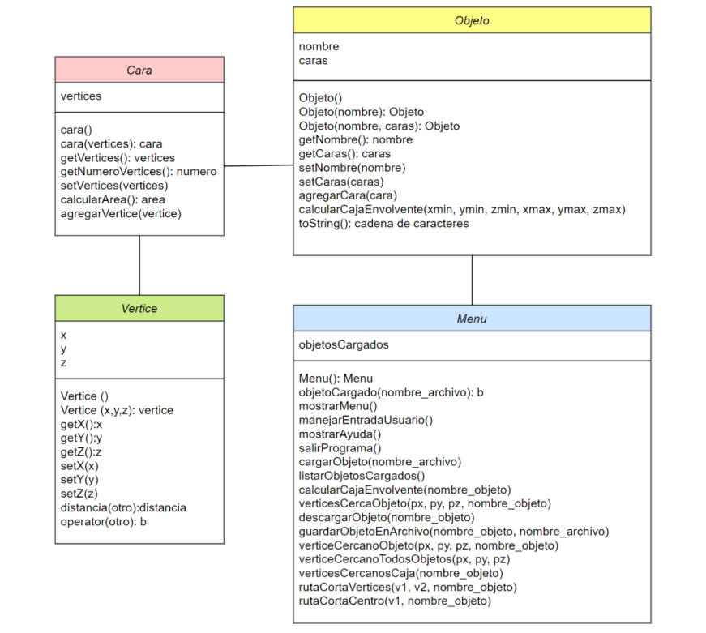
      <br>
      <sub><b>Component 1</b><br>Figura 9. Diagrama de relación de TADs</sub>
    </td>
    <td align="center" width="33%">
      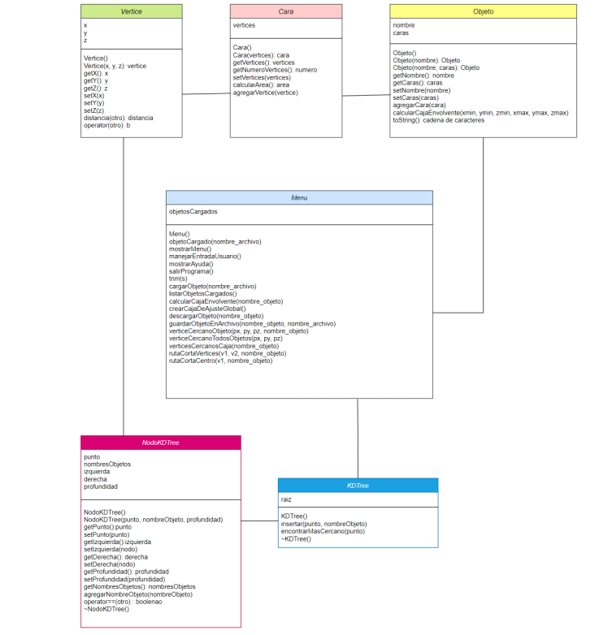
      <br>
      <sub><b>Component 2</b><br>Figura 54. Diagrama de relación de TADs</sub>
    </td>
    <td align="center" width="33%">
      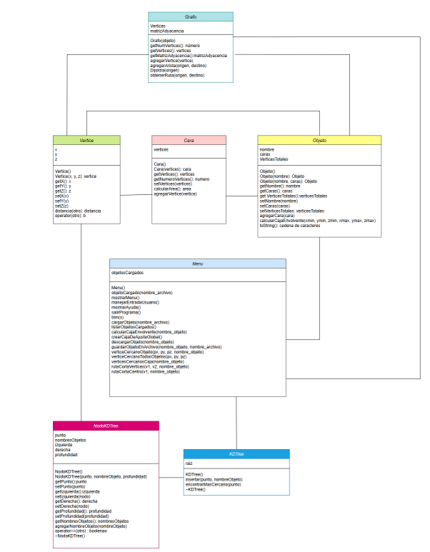
      <br>
      <sub><b>Component 3</b><br>Figura 70. Diagrama de relación de TADs componente 3</sub>
    </td>
  </tr>
</table>

---

## Key Algorithms

### Bounding Box Computation

Located in: [`objeto.cpp`](objeto.cpp)

For a given mesh, the algorithm iterates over all vertices in every face, tracking the minimum and maximum coordinates along each axis:

```
xmin = min(v.x for all v)    xmax = max(v.x for all v)
ymin = min(v.y for all v)    ymax = max(v.y for all v)
zmin = min(v.z for all v)    zmax = max(v.z for all v)
```

The resulting six values define the eight corners of an axis-aligned bounding box, which is stored as a new `Objeto` with six quadrilateral faces. A **global** bounding box computes the same limits across all loaded objects simultaneously.

<table>
  <tr>
    <td align="center" width="50%">
      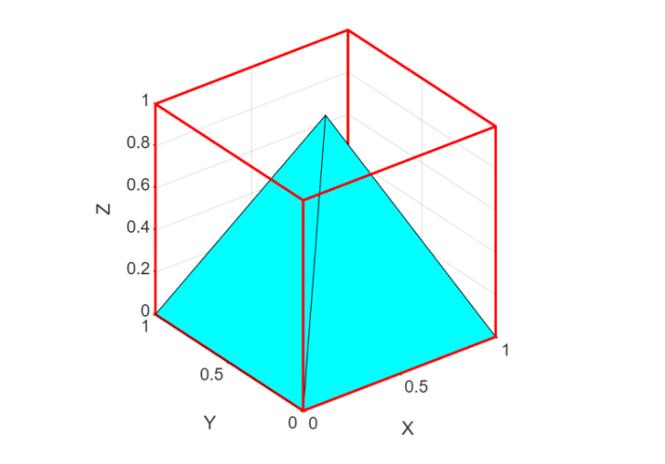
      <br>
      <sub><b>Per-Object Bounding Box</b><br>Figura 7. Caja envolvente de una pirámide</sub>
    </td>
    <td align="center" width="50%">
      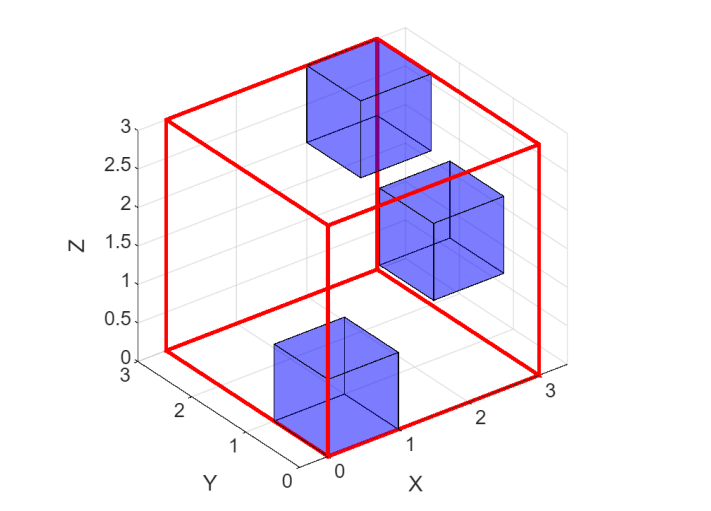
      <br>
      <sub><b>Global Bounding Box</b><br>Figura 8. Caja envolvente global</sub>
    </td>
  </tr>
</table>

### KD-Tree Nearest Neighbor Search

Located in: [`KDTree.cpp`](KDTree.cpp)

The KD-Tree partitions 3D space by cycling through the X, Y, and Z axes at successive depth levels. At each node, points are routed left or right depending on whether their coordinate along the current axis is less than or greater than the node's value.

**Nearest-neighbor search** descends the tree toward the query point, then backtracks when the splitting plane distance is less than the current best distance — ensuring no closer point is missed.

| Operation | Time Complexity |
|---|---|
| Insertion | O(log n) average |
| Nearest neighbor | O(log n) average |
| Worst case (degenerate) | O(n) |

<table>
  <tr>
    <td align="center" width="50%">
      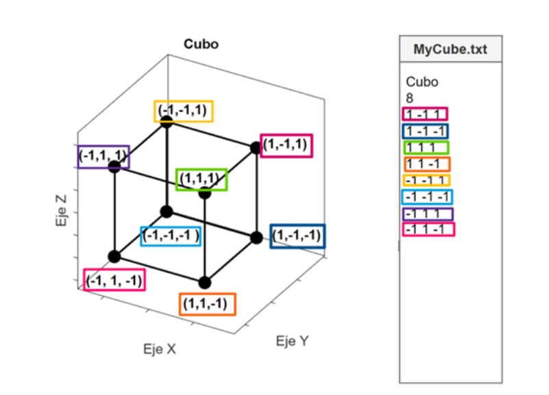
      <br>
      <sub><b>Input Mesh</b><br>Figura 52. Cubo para la construcción de KD-Tree</sub>
    </td>
    <td align="center" width="50%">
      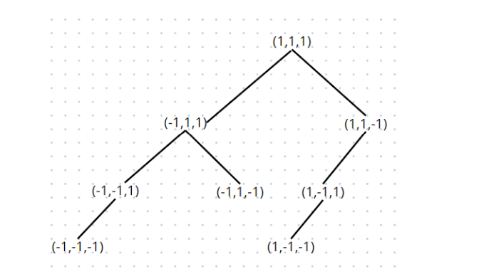
      <br>
      <sub><b>Resulting Tree</b><br>Figura 53. KD-Tree del cubo</sub>
    </td>
  </tr>
</table>

### Dijkstra's Shortest Path

Located in: [`Grafo.cpp`](Grafo.cpp)

The graph is constructed from the mesh topology: each unique vertex becomes a node, and each edge shared between two vertices within the same face becomes a weighted arc (weight = Euclidean distance between the vertices).

Dijkstra's algorithm computes single-source shortest distances using a `double`-precision distance matrix initialized to `infinity`. The predecessor array enables path reconstruction.

An additional command computes the shortest path from any vertex to the **geometric centroid** (average of all vertex coordinates), which is added as an extra node connected to the nearest existing vertex.

<table>
  <tr>
    <td align="center" width="50%">
      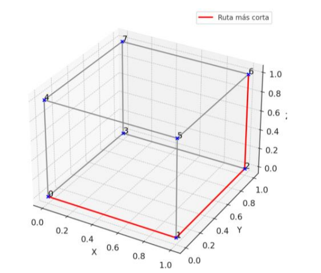
      <br>
      <sub><b>Vertex-to-Vertex</b><br>Figura 68. Ruta más corta de cubo unitario entre los vértices 0 y 6</sub>
    </td>
    <td align="center" width="50%">
      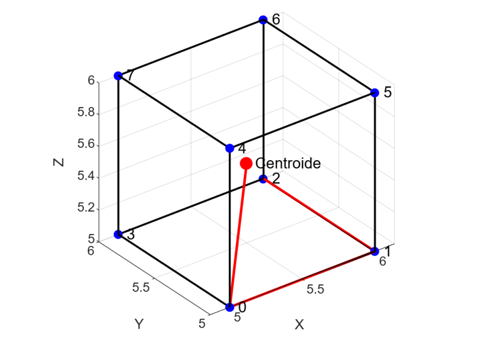
      <br>
      <sub><b>Vertex-to-Centroid</b><br>Figura 69. Ruta más corta desde vértice 0 a centroide</sub>
    </td>
  </tr>
</table>

---

## File Format

Mesh objects are stored in plain-text files with the following structure:

```
mesh_name
num_vertices
x0 y0 z0
x1 y1 z1
...
num_vertices_face_1 idx_0 idx_1 idx_2 ...
num_vertices_face_2 idx_0 idx_1 idx_2 ...
...
-1
```

| Field | Description |
|---|---|
| `mesh_name` | Object identifier (no spaces) |
| `num_vertices` | Total number of vertices in the mesh |
| Vertex lines | One line per vertex with `x y z` coordinates (doubles) |
| Face lines | Number of vertices in the face followed by their indices |
| `-1` | End-of-file sentinel |

A single file can contain multiple mesh definitions concatenated sequentially.

<table>
  <tr>
    <td align="center" width="50%">
      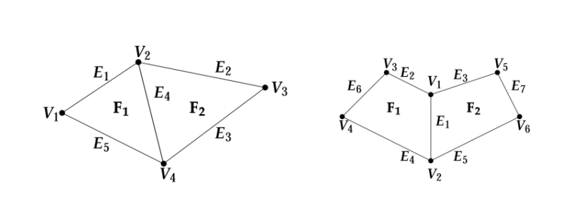
      <br>
      <sub><b>Polygonal Mesh Concept</b><br>Figura 1. Modelo poligonal (Bender & Manfred, 2003). Vertices (v), edges (E), and faces (f).</sub>
    </td>
  </tr>
</table>

---

## Available Commands

### Component 1 — Mesh Management

| Command | Description |
|---|---|
| `cargar <filename>` | Load one or more meshes from a text file into memory |
| `listado` | List all currently loaded objects with their vertex/face counts |
| `envolvente <object_name>` | Compute the axis-aligned bounding box of a specific object |
| `envolvente` | Compute the global bounding box enclosing all loaded objects |
| `descargar <object_name>` | Remove an object from memory |
| `guardar <object_name> <filename>` | Serialize an object to a text file |
| `ayuda` | Display the help menu |
| `salir` | Exit the program |

### Component 2 — Nearest Vertex

| Command | Description |
|---|---|
| `v_cercano <px> <py> <pz> <object_name>` | Find the nearest vertex to point (px, py, pz) within the specified object using a KD-Tree |
| `v_cercano <px> <py> <pz>` | Find the nearest vertex across all loaded objects |
| `v_cercanos_caja <object_name>` | Find the closest vertex to each corner of the object's bounding box |

### Component 3 — Shortest Path

| Command | Description |
|---|---|
| `ruta_corta <i1> <i2> <object_name>` | Shortest path between vertices `i1` and `i2` using Dijkstra |
| `ruta_corta_centro <i1> <object_name>` | Shortest path from vertex `i1` to the geometric centroid |

---

## Project Structure

```
mesh-graph-analyzer-cpp/
├── main.cpp              # Entry point — instantiates Menu and runs the input loop
├── menu.h                # Menu class declaration (command dispatcher)
├── menuComp0.cpp         # Core menu logic: parsing, help, load/save, list, unload
├── menuComp1.cpp         # Component 1: bounding box commands
├── menuComp2.cpp         # Component 2: nearest vertex commands (KD-Tree)
├── menuComp3.cpp         # Component 3: shortest path commands (Dijkstra)
├── objeto.h / objeto.cpp # Objeto class: mesh container with bounding box computation
├── cara.h / cara.cpp     # Cara class: polygonal face
├── vertice.h / vertice.cpp # Vertice class: 3D point with distance calculation
├── KDTree.h / KDTree.cpp # KD-Tree for spatial nearest-neighbor search
├── NodoKDTree.h / NodoKDTree.cpp # KD-Tree node
├── Grafo.h / Grafo.cpp   # Graph with adjacency matrix and Dijkstra implementation
├── docs/
│   └── images/           # Figures referenced in this README
└── .gitignore
```

---

## Setup and Installation

### Prerequisites

- A C++11 (or later) compiler: `g++`, `clang++`, or MSVC

### Build

```bash
git clone https://github.com/JuanR771/mesh-graph-analyzer-cpp.git
cd mesh-graph-analyzer-cpp
```

Compile all source files:

```bash
g++ -std=c++11 -o programa main.cpp menuComp0.cpp menuComp1.cpp menuComp2.cpp menuComp3.cpp objeto.cpp cara.cpp vertice.cpp KDTree.cpp NodoKDTree.cpp Grafo.cpp
```

### Run

```bash
./programa
```

The interactive console will display a prompt. Type `ayuda` to see all available commands.

---

## Proof of Concept

Visual demonstrations from the project documentation.

### Bounding Box Computation

<table>
  <tr>
    <td align="center" width="50%">
      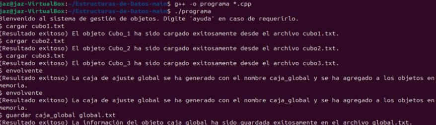
      <br>
      <sub><b>Console Output</b><br>Figura 11. Ejecución del comando envolvente</sub>
    </td>
    <td align="center" width="50%">
      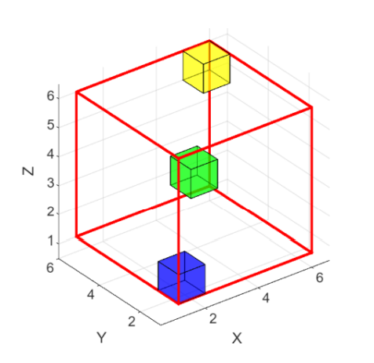
      <br>
      <sub><b>3D Visualization</b><br>Figura 13. Cubos en primer octante con caja envolvente global</sub>
    </td>
  </tr>
  <tr>
    <td align="center" width="50%">
      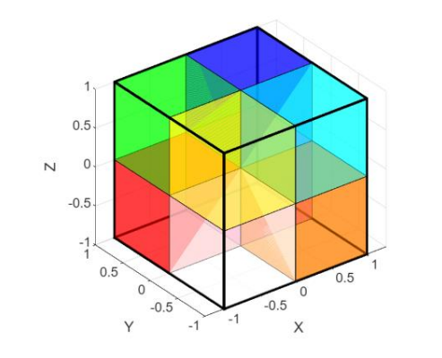
      <br>
      <sub><b>All Octants</b><br>Figura 15. Cubos en cada octante con caja envolvente global</sub>
    </td>
    <td align="center" width="50%">
      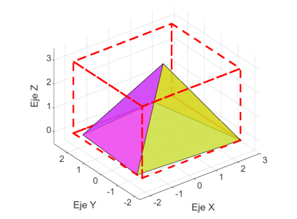
      <br>
      <sub><b>Pyramid Test</b><br>Figura 18. Pirámide y caja envolvente</sub>
    </td>
  </tr>
</table>

### KD-Tree Nearest Vertex Search

<table>
  <tr>
    <td align="center" width="50%">
      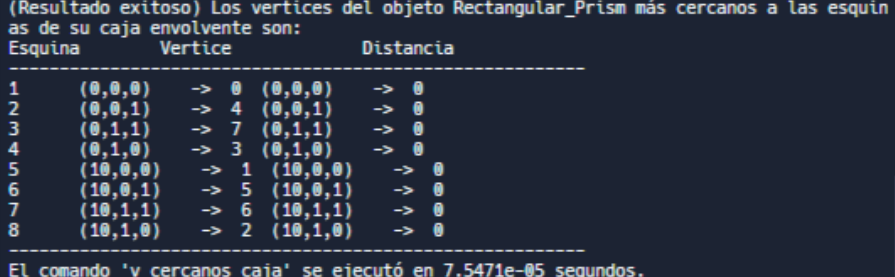
      <br>
      <sub><b>Rectangular Prism</b><br>Figura 56. Resultado de v_cercanos_caja para prisma rectangular</sub>
    </td>
    <td align="center" width="50%">
      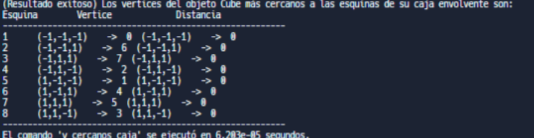
      <br>
      <sub><b>Cube Test</b><br>Figura 60. Resultado de cubo</sub>
    </td>
  </tr>
</table>

### Dijkstra Shortest Path

<table>
  <tr>
    <td align="center" width="50%">
      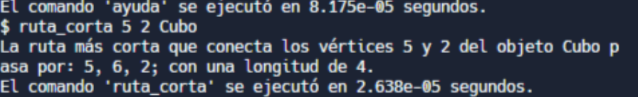
      <br>
      <sub><b>Cube Shortest Path</b><br>Figura 72. Salida del programa</sub>
    </td>
    <td align="center" width="50%">
      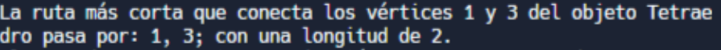
      <br>
      <sub><b>Tetrahedron Test</b><br>Figura 78. Salida del programa</sub>
    </td>
  </tr>
  <tr>
    <td align="center" width="50%">
      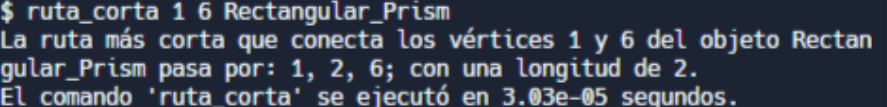
      <br>
      <sub><b>Rectangular Prism Test</b><br>Figura 82. Salida del programa</sub>
    </td>
  </tr>
</table>

---

## Development Team

| Member | GitHub Profile | Role |
|:--:|:--:|:--:|
| Daniel Castro | — | Development |
| Victoria Acero | — | Development |
| Juan Rozo | [@JuanR771](https://github.com/JuanR771) | Development |

> **Pontificia Universidad Javeriana** — Bogotá D.C., Colombia
> Data Structures Project
